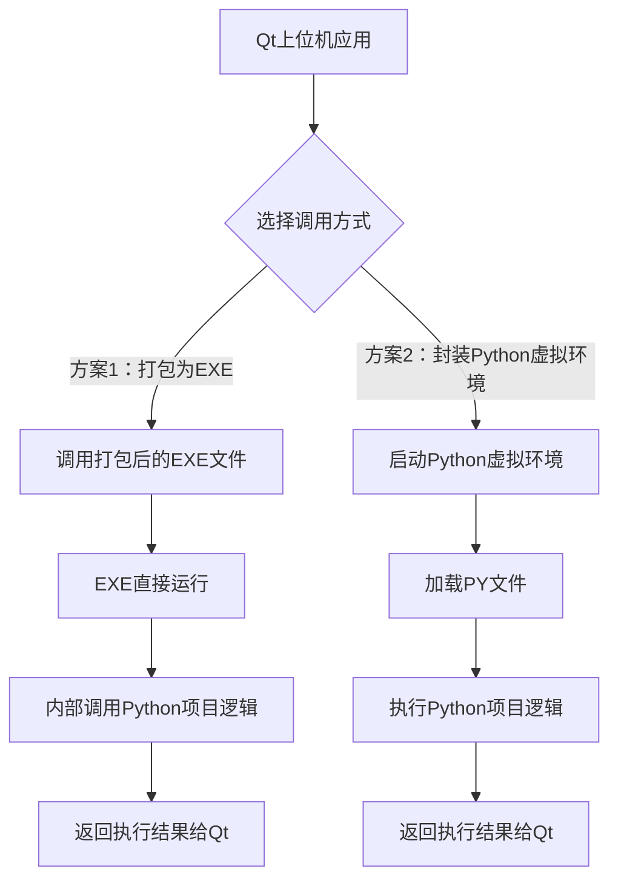
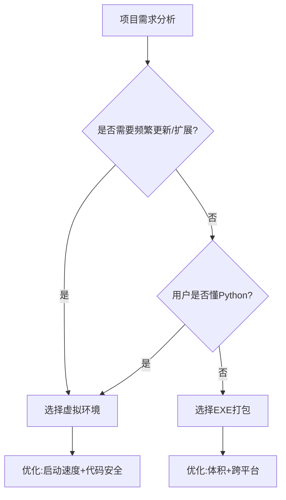

# 04.06

学习打包Python环境的两种方案



| **对比**         | **方案1：打包为EXE**                  | **方案2：封装Python虚拟环境**          |
| ---------------- | ------------------------------------- | -------------------------------------- |
| **用户环境依赖** | 无需Python环境，直接运行EXE           | 需要Python虚拟环境（由Qt程序自动管理） |
| **初始体积**     | 较小（单个EXE约5-20MB）               | 较大（虚拟环境约100-300MB）            |
| **扩展性**       | 每次扩展需新增EXE文件，总体积线性增长 | 只需添加PY文件，体积增长极小           |
| **维护成本**     | 每次修改需重新打包EXE                 | 直接修改PY文件，无需重新打包           |
| **启动速度**     | 较快（EXE直接运行）                   | 稍慢（需初始化Python环境）             |
| **代码安全性**   | 较高（EXE逆向难度大）                 | 较低（PY文件明文存储）                 |
| **跨平台兼容性** | 需为不同平台单独打包EXE               | 虚拟环境可跨平台（需统一Python版本）   |
| **调试难度**     | 困难（需重新打包调试）                | 容易（直接修改PY文件调试）             |
| **适用场景**     | 功能稳定、更新频率低的小型项目        | 功能迭代频繁、需要灵活扩展的中大型项目 |



```mermaid


```